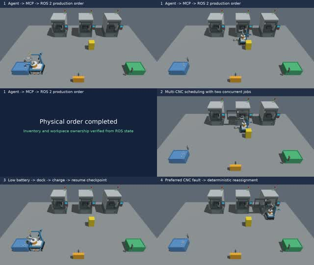

# Embodied Robotic Arm — ROS 2 多机床上下料

项目：履带外观(尚未实现，底盘目前是差速双轮)移动机械臂在三台同构 CNC 之间完成毛坯上料、并行加工、成品下料、低电量回充，以及受约束的中文LLM Agent 交互。

## 演示视频

[](docs/media/ros2_mobile_manipulator_final_showcase.mp4)

- [最终综合演示（193.50 秒）](docs/media/ros2_mobile_manipulator_final_showcase.mp4)：真实 Agent → MCP → ROS 2 订单、双机并行加工、低电量充电恢复和故障机床改派；
- [Agent 单件生产闭环（83.85 秒）](docs/media/agent_factory_cycle_presented.mp4)：自然语言请求、受限工具调用、行为树执行、RGB-D 选件、CNC 加工及成品回收。

视频来自无界面 Gazebo 物理仿真的 ROS 图像流，并与 Action 结果、最终工厂状态和日志哈希共同验收；没有通过物体位姿传送或剪辑伪造成功。

## 当前能力

- `IDLE / READY / PROCESSING / DONE / FAULT / HELD` 机床状态机与状态驱动调度；
- 加工结束自动进入可下料状态，Gazebo CNC 滑门跟随状态实际开关；
- 有料且机床空闲时自动派单，并支持完成当前订单后停止自动生产；
- 低电量只在夹爪为空的安全边界触发物理回充，达到目标电量后继续同一订单；
- 零件唯一归属、JSON 领域队列检查点和故障隔离；
- CNC 在装料前故障时释放待办并改派健康机床；机内已有工件时隔离该子任务并明确要求
  人工介入，不会修改寄存器假装恢复；
- 查询、下单、任务暂停/恢复/取消、机床 HOLD/RESUME、知识库故障解释；
- LLM JSON Schema 校验、8 秒超时、一次修复与中文规则降级；
- Web/MCP 共用 `/factory_agent/command` 结构化边界，查询不进入生产任务队列；
- 13 个 FastMCP 高层工具、机器可读 JSON 响应与追加式请求审计；
- 官方 UR5e、Robotiq 2F-85、自建可碰撞 CNC 内腔、LiDAR 和 RGB-D；
- Gazebo Harmonic、ros2_control 和 MoveIt 2 可运行；
- Nav2 全局导航、目标 AprilTag 选择及 Docking 视觉精对位已形成真实运动闭环；
- 原料不使用教导槽位或预知实体 ID：RGB-D 从整个稀疏料框中检测匿名候选并自主选件；
- 夹取必须通过新鲜 RGB-D、双指接触、实测开度保持和 30 mm 无辅助证明抬升；生产控制不读取 Gazebo 工件真值；
- `execute_order.xml` 总控整单批次，`load_raw.xml`/`unload_finished.xml` 总控单项任务；单件订单可完成原料取件、CNC 装夹加工、卸料和成品框放置；
- 充电座 Tag 20 视觉 Docking、几何接触、充电电流和电量增长已形成物理仿真闭环。
- 固定种子物理验收可断点续跑，逐次保存控制台、Action、工厂状态、机床状态和完整
  Gazebo/ROS 日志；未完成全部种子前不会输出“正式成功率”。

## 一次性检查与持续演示不要混用

下面四个脚本都是自动测试。`test_gazebo_smoke.sh` 验证控制器和传感器后会主动关闭
Gazebo，因此看到窗口启动后退出是正常结果，不是崩溃：

```bash
cd /home/taoxu/Embodied_Robotic_Arm
./scripts/run_checks.sh
./scripts/test_semantic_ros.sh
./scripts/test_gazebo_smoke.sh
./scripts/test_moveit_smoke.sh
```

`run_checks.sh` 只做构建、静态校验和单元测试，不会启动会运动的仿真任务。
大多数物理验收默认无界面运行。稀疏料框完整生产验收是面向手动观察的入口，
默认显示 Gazebo；任何脚本都可以用 `HEADLESS=false` 强制显示界面。

需要持续观察、操作 Gazebo 时使用：

```bash
./scripts/run_gazebo_demo.sh
```

该脚本会一直运行，按 `Ctrl+C` 才退出。也可直接执行：

```bash
source /opt/ros/jazzy/setup.bash
source install/setup.bash
ros2 launch factory_bringup gazebo.launch.py
```

## 在另一个终端手动控制

每个新终端先加载统一环境。这个脚本会加载 ROS 2 和工作区，并固定使用本机
CycloneDDS，避免 ROS 2 CLI 连接到旧的 daemon 或失效的 WSL 网卡：

```bash
cd /home/taoxu/Embodied_Robotic_Arm
source scripts/setup_ros_env.sh

./scripts/set_cnc_door.sh machine_1 open
./scripts/set_cnc_door.sh machine_1 close
./scripts/set_gripper.sh close
./scripts/set_gripper.sh open
```

夹爪是双滑轨等力控制：接触搜索使用每指 3 N，确认双侧触觉后切换到每指 12 N
的有界保持力；`open` 使用反向力并等待两指都回到安全开度。机床处于
`PROCESSING` 时，安全互锁会拒绝开门并在
`MachineCommand` 响应中返回 `accepted=False`；Shell 初始化错误发生在请求
发送之前，与机床状态无关。

可用下面的独立测试同时验证开关门和夹爪闭合—张开。它会自行启动并关闭 Gazebo，
不要和持续演示同时运行：

```bash
./scripts/test_manual_controls.sh
```

## 导航和视觉精对位

`navigate_station` 只执行地图坐标导航，到工位预停靠位后结束：

```bash
ros2 run factory_core navigate_station --ros-args -p station:=raw_bin
```

`dock_station` 执行完整的两阶段流程：Nav2 到预停靠位，再用该工位的 AprilTag
闭环精对位：

```bash
ros2 run factory_core dock_station --ros-args -p station:=raw_bin
```

离开工位进入普通导航前，显式执行：

```bash
ros2 run factory_core undock_station --ros-args -p dock_type:=factory_station
```

自动验收脚本会启动完整栈，并用 Gazebo 独立真值检查最终位置：

```bash
./scripts/test_docking_truth.sh
```
原料台精对位完成后，可调用受约束的抓取 action：

```bash
ros2 action send_goal --feedback \
  /manipulate_part factory_interfaces/action/ManipulatePart \
  "{operation: 0, station_id: raw_bin, part_id: manual-order:part:1, placement_slot_id: 0}"
```
原料 PICK 不接收来源槽位。RGB-D 在整个原料工作区选择一个可达候选，物理实体身份在
夹爪双指接触后才由仿真适配层确认；`placement_slot_id` 只在成品区 PLACE 时使用。

三个操作测试用途不同：

```bash
# 只验证 action 和非法请求拒绝，不运动机械臂
./scripts/test_manipulation_smoke.sh

# 真实执行导航、视觉对位、双指摩擦抓取、无辅助抬升和收臂
./scripts/test_raw_pick_truth.sh

# 完整执行原料台取料、带件导航、成品台放料和两次 undock
./scripts/test_raw_to_finished_truth.sh

# 无固定槽位单层原料：全工作区随机布局、RGB-D 选件和证明抬升
./scripts/test_sparse_bin_pick_truth.sh

# 无序单层原料经 CNC 加工后放入成品框的完整订单
HEADLESS=false ./scripts/test_sparse_bin_factory_cycle_truth.sh
# CI 无界面运行：HEADLESS=true ./scripts/test_sparse_bin_factory_cycle_truth.sh

# 推荐验收：同一物理闭环，分别限制机械臂和底盘总仿真时间
./scripts/test_manipulation_performance.sh
# 默认显示 Gazebo GUI；无界面运行：
# HEADLESS=true ./scripts/test_manipulation_performance.sh
# 可自定义门槛：
# MAX_MANIPULATION_SIM_SECONDS=120 MAX_BASE_SIM_SECONDS=65 ./scripts/test_manipulation_performance.sh

# 快速验证 Agent 启动自动生产、自动派单及 drain-stop
./scripts/test_automatic_production_ros.sh

# 中文 Agent → 自动协调器 → 真实 Gazebo 20 步订单
./scripts/test_agent_physical_order_truth.sh

# 完整执行充电座视觉对位，并验证真值位置、5 A 电流与电量增长
./scripts/test_charging_truth.sh

# 初始 20% 电量：先物理 Dock 充至 80%，再继续同一 CNC 订单
./scripts/test_low_battery_recharge_truth.sh

# 首选 CNC 预先故障：隔离故障机并由下一台健康 CNC 完成物理订单
./scripts/test_machine_fault_reroute_truth.sh

# CNC 装入工件后故障：隔离困料机床并继续回收健康机床成品
# 该场景预期返回部分完成和人工介入，不把安全停机误判成整单成功
./scripts/test_loaded_machine_fault_truth.sh

# Worker 中断：持久化最后阶段、拒绝未核对重放、人工确认后恢复
./scripts/test_machine_task_recovery_ros.sh

# 三件毛坯先装入三台不同 CNC，再依次回收成品
./scripts/test_three_machine_factory_cycle_truth.sh

# 30 个固定种子的非 Agent/MCP 物理生产验收；中断后执行同一命令即可续跑
./scripts/run_physical_seed_campaign.sh \
  --profile production --seeds 101-130

# 先用一个种子打开 GUI 观察；结果与完整日志保存在 artifacts/ 下
./scripts/run_physical_seed_campaign.sh \
  --profile production --seeds 101 --gui
```

`production` 统计档会轮换三台 CNC；原料数按种子在 3–6 件变化，每第 6 个种子执行
两件连续选取，每第 5 个种子加入低电量回充，每第 7 个种子加入空机故障改派，同时在
安全范围内扰动初始底盘位姿。原料不再属于六条预分区，而是在完整可达工作区内生成满足
130 mm 最小中心距的确定性无序布局。每次都启用 RGB-D 候选选择和成品框空槽感知。失败种子默认
保留为统计结果，不会通过反复重跑偷偷提高成功率；只有显式加 `--rerun-failed`
才会重试。正式结果保存在
`artifacts/ucloud_20260810/physical_seed_campaign_v47_final_production/`，每个场景和证据
文件都绑定 SHA-256；加 `--verify-only` 可只核验已有记录而不启动 Gazebo。30 个固定
seed 完成 29 个，正式成功率 96.67%；34 个 RGB-D 目标覆盖 20 个 50 mm 网格，
X/Y 跨度为 0.151/0.522 m，成功率和空间覆盖均通过预先设定的门槛。唯一失败 seed 124
保留在统计中，原因是料框边缘姿态的接近轨迹未达到独立 TCP 到达公差。详细数字和边界见
`docs/evaluation_results.md`。
Gazebo 稀疏料框额定容量为 6 件，但订单没有“6 件”格式上限；行为树在接单后读取实时
原料库存和成品框剩余容量，任一不足都会在物理动作前拒绝。

仿真默认使用 DART。当前物理主线是两个中部驱动轮加前后两个被动万向支撑轮；其余
四个外侧滚轮和履带带体用于表达履带外观，不参与地面碰撞。这个差速接触模型优先保证
平整工厂地面的可复现导航，不能写成真实履带接触仿真。底盘里程计会与 Gazebo 独立
真值比较，不能只靠“画面看起来能转”通过验收。

要在 Gazebo GUI 中观察完整生产过程：

```bash
HEADLESS=false ./scripts/test_sparse_bin_factory_cycle_truth.sh
```

物理订单脚本只允许一个实例占用固定的 ROS 域；若另一个实例尚未退出，会立即拒绝
第二次运行。Gazebo 子进程不会继承该锁，测试清理结束后即可重新启动。

## 从源码构建

```bash
./scripts/install_ros_jazzy.sh
source /opt/ros/jazzy/setup.bash
rosdep install --from-paths src --ignore-src -r -y
colcon build --symlink-install
source install/setup.bash
```

提交和查询中文指令：

```bash
ros2 service call /factory_agent/submit factory_interfaces/srv/SubmitNaturalLanguage \
  "{text: '加工3个零件'}"
ros2 service call /factory_agent/submit factory_interfaces/srv/SubmitNaturalLanguage \
  "{text: '查看机床状态和库存'}"
ros2 service call /factory_agent/submit factory_interfaces/srv/SubmitNaturalLanguage \
  "{text: '暂停2号机床加工'}"
ros2 service call /factory_agent/submit factory_interfaces/srv/SubmitNaturalLanguage \
  "{text: '你能做什么'}"
ros2 service call /factory_agent/submit factory_interfaces/srv/SubmitNaturalLanguage \
  "{text: '只用2号机床启动自动生产'}"
ros2 service call /factory_agent/submit factory_interfaces/srv/SubmitNaturalLanguage \
  "{text: '查看自动生产状态'}"
ros2 service call /factory_agent/submit factory_interfaces/srv/SubmitNaturalLanguage \
  "{text: '完成当前订单后停止自动生产'}"
```

结构化 Agent/MCP 验收与服务器启动：

```bash
./scripts/test_agent_command_ros.sh
./scripts/setup_mcp_env.sh
FACTORY_MCP_TRANSPORT=streamable-http ./scripts/run_factory_mcp.sh
```

接口、工具清单、响应格式与 Host 职责见 [MCP 与具身 Agent](docs/mcp_agent.md)。

## Agent 的定位

Agent 不是生产调度器。它把自然语言转换为白名单高层请求，并检索 SOP/故障知识用于
约束和解释。实际机床选择、零件归属、安全互锁、导航、运动规划和恢复均由确定性模块
完成。`/cmd_vel`、关节轨迹、主轴与急停从未作为 Agent 工具暴露。

`automatic_production_coordinator` 同样属于确定性层：它只在库存、电量和空闲机床满足
条件时提交一个有上限的 `ExecuteOrder`，并等待结果后再考虑下一批。停止自动生产只
阻止新订单；暂停或取消当前订单仍使用独立任务控制接口。

## 文档

- [系统架构](docs/architecture.md)
- [机床与 PLC/ESP32 握手](docs/machine_handshake.md)
- [事件、控制面与机器人任务队列](docs/task_execution_architecture.md)
- [模型与协议资源](docs/asset_sources.md)
- [工位导航、AprilTag 与视觉精对位](docs/station_docking.md)
- [履带外观差速底盘物理模型](docs/base_kinematics.md)
- [匿名选件与物理抓放执行链](docs/manipulation_pipeline.md)
- [验收与基准测试](docs/acceptance.md)
- [LLM Agent 安全设计](docs/agent_safety.md)
- [工程故障、根因与修复记录](docs/engineering_incidents.md)
- [正式评测结果与数字口径](docs/evaluation_results.md)
- [可复现 Docker 与云端执行](docs/reproducible_environment.md)
- [Agent 到机器人无界面演示证据](docs/demo_video.md)
