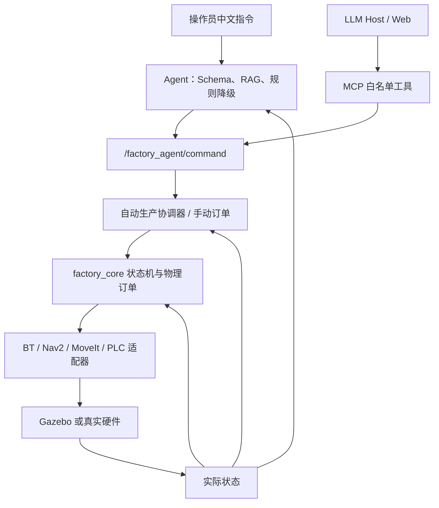

# 系统架构与实现边界

## 分层与依赖方向

自然语言与 MCP 最终汇入同一个结构化 ROS 服务；任何入口都不能直接越过该服务调用
Nav2、MoveIt、PLC 或底盘控制器。

依赖只向下：

1. `factory_core/domain.py` 是唯一机床、零件和订单规则来源，不依赖 ROS。
2. `factory_core/scheduler.py` 根据状态产生高层决策，不发布执行器命令。
3. `factory_interfaces` 是跨模块契约，禁止共享可变内部对象。
4. ROS 节点只做消息转换、调用和反馈；硬件差异留在适配器。
5. Agent 只能产生 `AgentCommand` 白名单请求，不能越过接口层。

## 三条运行通道

- **控制面**：查询、暂停、取消、HOLD/RESUME 立即处理，不进入机器人工作队列；
- **事件面**：机床状态事件按控制器会话与序号去重，并与当前世界状态对账；
- **执行面**：只有导航、卸料、上料、回充等长期占用机器人的任务进入持久化队列。

这样查询不会被上下料阻塞。完整标识符、依赖和电量门控设计见
[`task_execution_architecture.md`](task_execution_architecture.md)。

## Agent 与调度器不是同一个模块

Agent 可执行查询工厂、提交订单、查询进度、暂停/恢复/取消任务、请求机床受控
HOLD/RESUME、解释故障和列出能力。它将相关 SOP 条目放入 LLM 上下文，并要求输出通过
Pydantic Schema 的 `AgentCommand`。LLM 不可用时，中文规则解析器提供同一数据类型。

机床分配则始终由确定性调度器读取 `IDLE/DONE/FAULT/HELD` 状态决定。LLM 可以限制允许
机床，但不能声称某台机床空闲，也不能生成开门—关门—关节运动序列。

自动生产协调器位于 Agent 与 `ExecuteOrder` 之间。启动后，它读取库存、电量和机床状态，
一次只提交一个有上限的批次；订单未完成时不再派单。`STOP_AFTER_CURRENT` 会立刻关闭
后续派单，但让当前订单完成到夹爪、机床和库存一致的状态。订单失败时自动模式进入
`faulted` 并停止，而不是无限重试物理动作。

## 执行一致性

语义运行时在每个调度决策后写入检查点。接入 Nav2/MoveIt 后，适配器必须等 action
返回成功才提交状态变化；超时、取消和失败只记录尝试，不改变零件归属。

单个订单内遵守：

- 每个零件只能位于毛坯框、夹爪、某台机床或成品框之一；
- 夹爪最多持有一个零件；
- `PROCESSING` 必须关门且包含零件，`DONE` 才允许自动开门下料；
- 电量不足且夹爪非空时，先完成安全放置，再允许充电；
- 机床内零件发生不可复位故障时，不做“传送式恢复”；
- `HOLD` 是受控进给保持，急停只能来自独立硬件安全回路。

## 物理适配状态

Gazebo 使用官方 UR5e、Robotiq 2F-85 和自建 CNC 碰撞骨架。CNC 门是实际棱柱关节，
`door_visualizer` 只把领域层已校验的门状态映射到 Gazebo 位置命令。真实部署时可用
OPC UA/Modbus/PLC 节点替换这层，状态机、调度器和 Agent 不改。

物理栈启动时，`factory_runtime` 只拥有机床、库存和电池状态；
`factory_task_bt_executor` 独占 `/factory/execute_order` 与 `/factory/execute_robot_task`，
从 `execute_order.xml` 加载整单批次顺序，并由 `load_raw.xml`/`unload_finished.xml` 加载单项任务顺序。每个异步叶节点调用
`/factory/execute_physical_step`，由 `physical_order_executor` 适配 Docking、`ManipulatePart`、
PLC 和库存 Service。每次物理 Action 成功后才提交业务状态。

行为树把单件周期拆成“11 个主要装料动作 + 9 个主要卸料动作”，外层再增加会话、
电量、前置条件和失败清理节点。订单执行器按可用机床数形成生产批次，每批先把
工件装入互不相同的 CNC 并启动加工，再逐台等待和卸料；机器人本身仍串行操作，但 CNC
加工可与机器人为下一台上料重叠。单件 20 步和双机床双件 40 步都已由一个
`ExecuteOrder` 在 Gazebo 中完整通过。执行器在每个物理步骤边界发布反馈并记录耗时，
库存只在对应物理 Action 成功后提交。

CNC 走廊按空间约束执行显式规划器策略：门内垂直进出和跨门平面使用 Pilz LIN，门外折叠/运输
依次尝试经过碰撞检查的 PTP/OMPL 候选；任何候选都必须规划并执行成功。这避免把一个规划器强行用于整段轨迹造成的
Cartesian IK 跳支。底盘使用低位 RGB-D 观察料框/充电座，使用高位 RGB-D 观察 CNC
Tag；Docking 完成后还必须由里程计连续证明底盘停稳，MoveIt 才能使用 `base_link`
中的工位坐标。

低电量回充恢复、装料前故障改派、加工中困料故障隔离和三机床三工件闭环已经分别
完成物理实测，但单次或少量通过不能视为统计成功率。BehaviorTree.CPP 叶节点与
真实 Gazebo 物理订单已经联调通过。正式 101–130 固定种子批次为 29/30（96.67%）；
唯一失败的通用垂直接近修复已通过 seed 124 定向复测，但未用定向结果回填原统计。若要
形成新的正式数字，应从新进程完整重跑 30 个种子，而不是只重跑失败样本。

生产控制链不读取 Gazebo 工件真值、不写模型位姿且不使用夹爪运输附着关节；真值只由
外部测试评分。即便如此，本项目仍只能宣称 Gazebo 物理仿真闭环，不能宣称实机部署。
