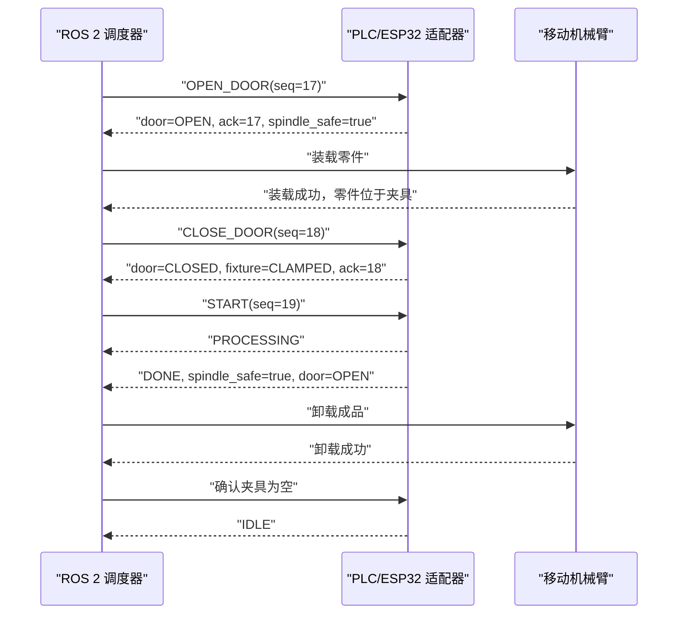

# 机床、机器人与 PLC/ESP32 握手

## 职责边界

生产调度由机床状态驱动，不由 LLM 编排逐个动作。真实系统可将 ROS 2 的
`MachineCommand.srv` / `MachineState.msg` 替换成 OPC UA、Modbus TCP 或厂商 PLC
适配器；领域状态机与上层调度不变。

- 机床控制器/PLC：门、夹具、主轴停止确认、互锁和加工周期。
- ROS 2 调度器：选择健康空闲机床，维护零件归属，派发上下料任务。
- 机械臂执行器：导航、精对位、抓放，成功后提交动作结果。
- Agent：理解订单约束、查询/解释、任务暂停取消、请求受控进给保持。
- 硬件安全回路：急停、门锁和安全速度；Agent 与普通 ESP32 均无权绕过。

## 建议寄存器/数据点

| 数据点 | 方向 | 含义 |
|---|---|---|
| `machine_mode` | PLC → ROS | IDLE/READY/PROCESSING/DONE/FAULT/HELD |
| `door_state` | PLC → ROS | CLOSED/OPENING/OPEN/CLOSING/FAULT |
| `spindle_safe` | PLC → ROS | 主轴已停止且允许开门 |
| `fixture_state` | PLC → ROS | EMPTY/CLAMPED/UNCLAMPED/FAULT |
| `part_present` | PLC → ROS | 夹具内零件检测 |
| `command_seq` | ROS → PLC | 单调递增命令序号，防止重复执行 |
| `command` | ROS → PLC | OPEN/CLOSE/START/HOLD/RESUME/RESET |
| `ack_seq` | PLC → ROS | 已完成的命令序号 |
| `fault_code` | PLC → ROS | 厂商故障码 |

## 正常时序

仿真中的 `Machine` 类表示这些控制器寄存器；Gazebo 门节点仅把经过校验的
`door_open` 状态映射到门关节，不承担安全判定。

## 三种“停止”必须分开

- `PAUSE_TASK`：暂停新任务派发，不改变机床内部加工状态。
- `HOLD_MACHINE`：请求 CNC 受控进给保持，保留剩余周期，可恢复。
- 急停：人员/设备风险下由硬件安全链路动作，不能作为 Agent 工具。
