# 基于物理证据的抓取与放置执行链

## 1. 这条主线明确不做什么

生产运行时不读取 Gazebo 工件真值来修正目标，不写模型位姿，不把工件传送到目标，也不在
夹爪和工件之间创建 `DetachableJoint`。缺失、陈旧或互相矛盾的视觉/接触/关节证据会使
`ManipulatePart.action` 返回 `PHYSICAL_EVIDENCE_FAILED`，不会切换到标定坐标假装成功。

Gazebo entity/link 位姿只允许出现在测试脚本的外部观察器中，用于布置随机场景和黑盒评分；
它不参与生产 Action 的成功判定。这个边界由 `test_no_truth_control_boundary.py` 自动检查。

## 2. 目标位姿从哪里来

- 原料框：低位 RGB-D 将深度点转换到 `base_link`，在三维 ROI 内分割单层、分离圆柱，
  连续多帧稳定后输出**无实体 ID 的候选集合**；控制器按离料框可达中心最近的确定性策略
  选择一个候选，其余候选作为 MoveIt 碰撞物保留。没有新鲜候选就拒绝抓取。
- 仿真启动时，场景生成器在料框整个可达平面内采样 1–6 件原料，不设置槽位或分区。
  130 mm 最小中心距是对“单层分离上料”任务的物理场景约束，用于避免初始穿模与相互接触，
  不是提供给抓取控制器的答案；控制器只接收相机候选。
- CNC：AprilTag 先完成底盘相对工位对位，高位 RGB-D 再测量夹具区域内的工件 XY；
  夹具支撑高度来自经过测量的固定工装几何。
- 成品框：`CameraInfo + TF + depth` 将教导槽位投影到图像，只有连续多帧为
  `observable && empty` 的槽位才允许放置。

YAML 保存固定设施的示教关系、工件尺寸和安全走廊，而不是一次运行中随机工件的答案。

## 3. PICK 的提交顺序

```mermaid
flowchart LR
    V["校验请求和新鲜感知"] --> S["建立 MoveIt 碰撞场景"]
    S --> O["张开双指"]
    O --> A["MoveIt 到预抓取位"]
    A --> G["目标正上方垂直下探"]
    G --> C["开始闭合并监听本次接触窗口"]
    C --> B["左右指尖均接触目标"]
    B --> H["切换为双指等力承载保持"]
    H --> R["释放原料定位夹具"]
    R --> P["仅靠接触和摩擦试举 30 mm"]
    P --> T["持续验证双指接触和关节开度"]
    T --> M["加入 MoveIt 携带物碰撞几何"]
    M --> X["撤离到带件运输姿态"]
```



触觉不是“夹紧前的许可”。夹爪先朝视觉候选施加低强度、对称的闭合力；原料尚无业务身份时，
接触监视器要求本次窗口内恰好一个物理实体同时接触左右指尖，然后才建立
`订单逻辑 ID → Gazebo 物理实体 ID` 映射。CNC 卸料则要求再次接触此前已绑定的同一物理
实体。随后系统切换到有界承载保持力。双滑轨的**行程之和**决定实际夹口，行程之差只反映
工件相对夹爪中心的偏移，因此保持验证使用总闭合量及其变化，而不会把合法偏心抓取误判
为单指故障。单指接触、左右指分别碰到
不同工件、多个实体同时满足、桌面接触、旧消息或没有关节反馈都不能通过。

试举之后不查询工件世界位姿。系统要求连续的新鲜双指接触、总闭合量保持在测得值附近，
且保持控制器未失效。也就是说，Gazebo 工件真正由夹爪碰撞、法向力和摩擦携带。

## 4. 为什么物理上能夹住

两侧接触的简化承载条件为：

```text
2 * μ * N > m * (g + a) * safety_factor
```

`μ` 是指垫摩擦系数，`N` 是单指法向力。项目同时使用合理摩擦、V 形指垫约束圆柱横向
滚动、接触后有限力保持以及带件加速度包络。不能靠无限摩擦或无限力解决，因为这会掩盖
错误接触几何并引发弹飞、振荡或穿透。

## 5. MoveIt 的 AttachedCollisionObject 不是物理附着

通过试举后，`PlanningSceneClient.attach_carried_workpiece_geometry()` 只告诉 MoveIt：
规划时要把圆柱作为机器人携带的碰撞几何。这个 ROS PlanningScene 消息不能向 Gazebo
施力，也不能创建约束；若夹爪失去物理接触，物体仍会掉落。

因此系统有两条同时成立的链：

- Gazebo：手指碰撞 + 摩擦 + 控制器预载负责真正承载；
- MoveIt：`AttachedCollisionObject` 负责后续轨迹的碰撞包络。

## 6. PLACE 的提交顺序

1. 进入目标 Planning Scene，并再次验证携带期间的双指接触和开度；
2. 经过碰撞检查的运输/接近走廊到达目标上方；
3. 沿受控直线下降；CNC 允许小范围、逐步、碰撞检查的接触搜索；
4. 必须收到指定工件与指定支撑面的新鲜接触；
5. CNC 场景在支撑成立后闭合夹具，成品框则保持桌面支撑；
6. 张开双指，并证明两指均已离开工件；
7. 机械臂安全退出；成品框还要求 RGB-D 看到放置后占用；
8. 更新 MoveIt 世界碰撞几何，Action 才返回成功。

接触搜索是有界的物理探索，不是兜底：每个尝试都经过规划和碰撞检查，且最终必须有新鲜
支撑接触。搜索耗尽会显式失败，绝不把名义夹具高度当作放置成功。

## 7. 允许存在的夹具约束

世界中的 `fixture_clamp_constraints` 只模拟原料定位工装或 CNC 虎钳。PICK 时必须先由
双指接管工件再释放源夹具；PLACE 时必须先证明工件落在 CNC 支撑面再锁紧夹具。它不是
夹爪运输稳定器，不会移动工件，也不能把漏抓变成成功。

## 8. 底盘与机械臂的交接边界

Nav2 先到示教预停靠位，AprilTag 完成局部相对对位。Docking 返回后，执行器还要求
`/odometry/filtered` 连续满足速度阈值才允许 MoveIt 运动。该里程计由轮速/状态估计产生；
`/ground_truth/odom` 只供测试评分与底盘诊断，生产栈不使用它。

## 9. 当前能力与边界

- 已完成整个料框工作区内无固定槽位的单层直立圆柱 RGB-D 选取、真实双指夹持、CNC
  装卸和成品框感知放置；
- 已完成 BehaviorTree.CPP 单件物理订单黑盒验收；
- 原料 YAML 中只有一个“料框选择区域”参考，不存在 `raw_part_1/2/3` 对应的教导抓取点；
- Gazebo 预创建 6 个物理工件是料框场景容量，用于碰撞、接触和夹具模拟，不是算法槽位；
  启动参数可激活 1–6 件，行为树只依据 `/factory/get_state` 的当次库存决定是否接单；
- 不支持堆叠、严重遮挡、任意姿态和通用 6D bin-picking；
- 正式 30-seed 通过 29/30（96.67%），该数字只适用于上述结构化仿真分布；
- 真值验收脚本证明结果，但不参与控制，这一点必须与“控制依赖真值”区分。

## 10. 源码阅读顺序

1. `factory_interfaces/action/ManipulatePart.action`
2. `factory_core/config/manipulation.yaml`
3. `factory_perception/sparse_bin.py` 与 `slots.py`
4. `factory_core/manipulation_evidence.py`
5. `factory_core/gripper_client.py`
6. `factory_core/planning_scene_client.py`
7. `factory_core/manipulate_part_server.py` 的 `_pick()` / `_place()`
8. `scripts/test_raw_pick_truth.sh`：外部黑盒验收，不是运行时控制
