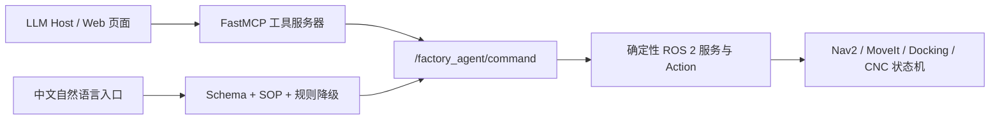

# MCP 与具身 Agent 接口

## MCP 在本项目中的位置

MCP 不是新的调度器，也不替代 ROS 2。它把已经存在的高层业务能力暴露给网页、桌面
助手或其他 LLM Host：



仓库内的 `factory_operator` 是可直接使用的 LLM Host；外部桌面助手也可替代它。

对话历史、模型连接和工具选择由 LLM Host 管理；MCP Server 不保存一份“模型记忆”。
每次工具调用都重新构造 `AgentCommand`，先在 MCP 进程内通过 Pydantic 校验，再由
`/factory_agent/command` 服务二次校验。两层校验使用同一份领域契约。

## 查询不会进入机器人任务队列

以下工具是同步控制面请求，直接读状态或知识库：

- `get_factory_state`
- `get_task_status`
- `get_automatic_status`
- `explain_failure`
- `list_capabilities`

它们不会生成导航、抓取、放置或充电任务，因此不需要等待前面的上下料任务完成。
`submit_order` 和自动生产协调器才会向 `ExecuteOrder.action` 提交长期生产任务。
暂停、取消和机床 HOLD/RESUME 也是控制面请求，但底层状态机可以依据当前安全状态拒绝。

## 工具白名单

MCP 暴露十三个工具：

| 类别 | 工具 |
| --- | --- |
| 查询 | `get_factory_state`、`get_task_status`、`get_automatic_status` |
| 订单 | `submit_order` |
| 自动生产 | `start_automatic`、`stop_automatic` |
| 任务控制 | `pause_task`、`resume_task`、`cancel_task` |
| 机床控制 | `hold_machine`、`resume_machine` |
| 知识与能力 | `explain_failure`、`list_capabilities` |

`stop_automatic` 是完成当前安全工作后的 drain-stop，不是急停。MCP 没有 `/cmd_vel`、
关节轨迹、夹爪电机、门电机、主轴、PLC 寄存器写入或急停工具。

## 结构化响应

所有 MCP 工具返回同一外层结构：

```json
{
  "accepted": true,
  "request_id": "request-7f0d8cba4201",
  "order_id": "",
  "operation": "get_factory_state",
  "source": "mcp",
  "message": "machine_1=IDLE, ...",
  "data": {
    "machines": [],
    "inventory": {
      "raw_parts": 6,
      "finished_parts": 0,
      "held_part_id": ""
    },
    "battery": {
      "percentage": 0.42,
      "voltage": 48.0,
      "current": 0.0
    },
    "active_order_id": ""
  }
}
```

`message` 供人阅读，`data` 供程序使用。调用方不需要从中文文本中提取库存或订单 ID。
只有确定性 ROS 执行器真正接受 Action/Service 后，`accepted` 才会是 `true`。

## 启动

先构建并启动语义演示或 Gazebo 物理栈，保证 `factory_agent_node` 正在运行：

```bash
./scripts/run_checks.sh
ros2 launch factory_bringup semantic_demo.launch.py
```

首次创建独立 MCP 环境：

```bash
./scripts/setup_mcp_env.sh
```

启动 Streamable HTTP（默认端口 8000，路径 `/mcp`）：

```bash
FACTORY_MCP_TRANSPORT=streamable-http ./scripts/run_factory_mcp.sh
```

需要由本机客户端以子进程方式连接时：

```bash
FACTORY_MCP_TRANSPORT=stdio ./scripts/run_factory_mcp.sh
```

独立虚拟环境使用 `--system-site-packages`，因此既能加载官方 MCP SDK，也能加载
ROS 2 Jazzy 的 `rclpy`。SDK 不加入普通 ROS 运行依赖；没有 MCP SDK 时，物理生产、
中文规则降级和所有 ROS 验收仍可运行。

### 浏览器显示 `Client must accept text/event-stream`

这是正常的协议响应，不是服务闪退。浏览器地址栏发出的是普通 HTTP GET，而 `/mcp`
只接受完成 MCP 初始化握手的 Streamable HTTP 客户端。用官方 SDK 验证正在运行的
8000 端口：

```bash
.venv-mcp/bin/python scripts/mcp_acceptance_client.py \
  --url http://127.0.0.1:8000/mcp \
  --smoke-only
```

该命令会初始化 MCP 会话、发送 ping、列出并核对十三个工具，再经 MCP 查询一次 ROS
工厂状态。它比在浏览器中打开端点更能说明服务是否真正可用。

端口可配置，方便并行测试或避免冲突：

```bash
FACTORY_MCP_HOST=127.0.0.1 FACTORY_MCP_PORT=8012 \
  ./scripts/run_factory_mcp.sh
```

如果握手和工具列表正常，但工具返回 `factory Agent ROS service is unavailable`，说明
MCP 进程与 ROS 节点不在同一个 `ROS_DOMAIN_ID`。停止旧 MCP 进程，在启动工厂所用
的同一个环境中重新执行：

```bash
FACTORY_ROS_DOMAIN_ID=0 ./scripts/run_factory_mcp.sh
```

`FACTORY_ROS_DOMAIN_ID` 应与工厂 bringup 使用的值一致。

## 使用 LLM 操作员

`factory_operator` 每次接收指令时执行以下流程：

1. 从 MCP Server 动态读取工具名称、说明和 JSON Schema。
2. 核对工具集合必须恰好等于项目的十三项白名单。
3. 按用户问题检索最多三条 SOP，并与固定权限边界一起加入模型上下文。
4. 将模型选择的工具名和参数再次与白名单核对。
5. 调用 MCP，把结构化结果返回模型，再生成中文答复。

工具 Schema 和安全提示每次请求都会发送，不能依赖模型“第一次记住”。同一轮最多执行
一个会改变状态的工具；模型幻觉出的低层工具在到达 MCP 前就会被拒绝。

先启动工厂和 MCP Server，然后配置 OpenAI-compatible API：

```bash
export OPENAI_API_KEY="..."
export OPENAI_BASE_URL="https://api.openai.com/v1"
export FACTORY_AGENT_MODEL="your-tool-calling-model"

# 单条指令
./scripts/run_factory_operator.sh "查看机床、库存和电量"

# 交互模式
./scripts/run_factory_operator.sh
```

调用其他兼容服务时只需调整 `OPENAI_BASE_URL` 和 `FACTORY_AGENT_MODEL`。API Key
只从环境变量读取，不写入命令日志、ROS 消息或 Agent 审计文件。

这条工具调用路径与 `/factory_agent/submit` 的规则降级路径互补：

| 入口 | 模型不可用时 | 适用场景 |
| --- | --- | --- |
| `/factory_agent/submit` | 自动使用中文规则解析 | 标准生产命令、离线保底 |
| `factory_operator` + MCP | 报告模型连接错误，不执行工具 | 多轮查询、工具选择、自然语言解释 |

LLM Host 不是安全控制器。无论模型来自哪里，最终导航、抓放、充电、机床握手和状态
恢复仍由确定性 ROS 2 模块执行。

不使用云端密钥的完整验收：

```bash
./scripts/test_llm_mcp_ros.sh
```

脚本会启动本地 OpenAI-compatible 假模型、MCP Server 和语义工厂，验证中文订单经
LLM 工具选择进入 ROS、保留机床约束与订单 ID，并最终完成两件产品。假模型仅用于
验证协议编排，不代表真实模型的语言理解效果。

## 本地操作员页面

页面和命令行使用同一个 `McpOperatorHost`，不会在浏览器里保存或发送 API Key。先启动
工厂、MCP Server 并配置模型环境变量，然后运行：

```bash
./scripts/run_factory_operator_web.sh
```

浏览器访问：

```text
http://127.0.0.1:8080
```

页面提供：

- 中文操作员对话与常用指令；
- 三台机床、毛坯、成品和电量状态；
- 当前订单 ID；
- 每次 MCP 工具调用的参数、协议结果和 ROS 接受结果；
- 模型未配置、MCP 不可用和业务拒绝的可读错误。

服务默认只监听本机回环地址。若指定 `0.0.0.0` 或局域网地址，必须显式添加
`--allow-remote`；这只解除监听保护，不等于已经具备登录认证，因此生产控制场景不应
直接暴露到公网。

页面端到端验收：

```bash
./scripts/test_operator_web_ros.sh
```

该脚本使用独立端口启动本地假模型、MCP、操作员页面和语义工厂，经 HTTP 对话接口
提交受约束订单，并确认 ROS 最终生成两件成品。API Key 泄漏、安全响应头和非法 HTTP
请求由单元测试覆盖。

## 不经过 MCP 的结构化调试

可以直接调用 MCP 与网页共用的 ROS 服务：

```bash
ros2 service call /factory_agent/command \
  factory_interfaces/srv/ExecuteAgentCommand \
  "{source: manual, operation: get_factory_state, auto_recharge: true}"

ros2 service call /factory_agent/command \
  factory_interfaces/srv/ExecuteAgentCommand \
  "{source: manual, operation: submit_order, quantity: 2,
    allowed_machine_ids: [machine_1, machine_3], auto_recharge: true}"
```

自动化验收：

```bash
# ROS 结构化边界
./scripts/test_agent_command_ros.sh

# 官方 MCP Client → MCP Server → ROS Agent → 订单执行器
./scripts/test_mcp_ros.sh

# 中文指令 → OpenAI-compatible LLM → MCP → ROS 订单执行器
./scripts/test_llm_mcp_ros.sh

# 浏览器 API → LLM Host → MCP → ROS 订单执行器
./scripts/test_operator_web_ros.sh
```

该脚本验证结构化状态、能力白名单、非法机床拒绝和两件订单完成。纯 Python 测试还会
验证非法数量/机床在到达 ROS 前被拒绝，以及 MCP 工具名与白名单完全一致。
`test_mcp_ros.sh` 使用独立 ROS 域和 8011 端口，无需 Gazebo GUI，也不会干扰正在
8000 端口运行的 MCP 服务。`test_llm_mcp_ros.sh` 还验证 LLM 工具调用编排，全程
不访问外网。

## 审计

每次高层请求追加到：

```text
~/.ros/factory_agent_commands.jsonl
```

可用 `FACTORY_AGENT_AUDIT_LOG` 改变路径。记录包含 UTC 时间、请求 ID、来源、操作、
接受结果、订单 ID 和底层说明；不记录 API Key，也不直接保存原始对话文本。
