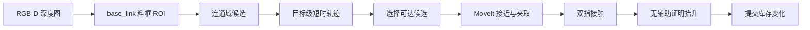

# 无固定槽位料框取件：从场景随机化到视觉候选

## 当前做到哪一层

生产路径使用“单层分离、无固定槽位”的原料框模式：

- 1–6 个相同直立圆柱在料框整个可达平面内按随机种子改变 XY，不划分预设区域；
- 工件单层摆放、彼此分离，不允许堆叠或严重遮挡；
- RGB-D 深度点被变换到 `base_link`，只保留料框三维工作区内的点；
- 图像连通域生成匿名候选，执行端对单个目标建立短时空间轨迹；
- 目标需在最近窗口至少出现三次、抖动小于 15 mm，并且在最新帧仍可见；
- 其他工件偶发漏检不会再清空已经形成的目标轨迹；
- MoveIt 使用视觉候选的 XYZ 和直立圆柱抓取先验生成接近、闭爪和撤离轨迹；
- 候选必须通过新鲜度、工作区、连续帧稳定性以及预抓取/抓取端点的 IK 和碰撞检查；
  生产控制链不读取 Gazebo 工件真值；
- 夹取成功仍必须通过双指接触和无辅助证明抬升。

因此，原料位置不再是一个完全固定的 XYZ 点，但这还不等于工业意义上的堆叠
bin-picking。

## 为什么原料匿名，成品却使用槽位

毛坯在被取走前是可互换库存，感知不需要先给每个轮廓分配业务 ID。调度器预留一个
逻辑物料，执行器选择其允许区域内的稳定候选；夹取成功后才提交库存变化。

成品框使用预留槽位是有意的确定性设计。这样可以：

1. 避免已经放好的成品被下一次放置碰撞；
2. 从订单数量直接得到空闲位置；
3. 让失败恢复和库存核对有明确依据。

“把成品随意丢进框里”反而会给下一次放置和人工取件带来不确定性。若希望做随机
自由放置，应增加成品框占用栅格和空闲区域规划，而不是写死一个新的随机坐标。

## 数据与控制边界



视觉负责回答“哪里有一个可抓的毛坯”；MoveIt 负责无碰撞运动；夹爪接触和证明抬升
负责回答“是否真的夹住”；库存只在物理成功后改变。这四层不能互相替代。

## 代码阅读顺序

1. `factory_perception/sparse_bin.py`：纯 NumPy 几何和候选生成；
2. `factory_perception/sparse_bin_detector_node.py`：ROS 图像、相机内参与 TF 适配；
3. `factory_core/raw_part_perception.py`：时间稳定性与候选选择；
4. `factory_core/manipulate_part_server.py`：把候选接入既有物理抓取流程；
5. `factory_perception/raw_bin_randomizer.py`：仅用于 Gazebo 固定随机种子测试；
6. `scripts/test_sparse_bin_pick_truth.sh`：物理验收入口。

## 如何验证

```bash
./scripts/test_sparse_bin_pick_truth.sh
```

通过条件不是 action 返回成功，而是同时满足：

- RGB-D 持续发布至少一个候选，所选目标通过目标级稳定性检查；
- action 反馈包含 `PERCEIVE_RAW_PART`；
- 选中目标来自新鲜 RGB-D 轨迹，并通过工作区、稳定性、IK 和碰撞约束；
- 两侧手指都发生接触；
- 去掉辅助固定后工件仍被抬升并保持到携带位。

正式 2026-08-10 物理批次覆盖 seed 101–130：

- 30 个端到端场景完成 29 个，正式成功率 96.67%；
- 共记录 34 次 RGB-D 实际选件，覆盖 20 个 50 mm 空间网格；
- 目标 X/Y 跨度分别为 0.151 m 和 0.522 m；
- PICK 叶节点为 68/69，唯一失败后来定位为横向接近走廊与邻近工件冲突；
- 通用垂直接近修复后 seed 124 定向复测通过，但不回填正式统计。

这些是整个物理系统的结果，不应表述为感知节点单独成功率。完整数字以
`evaluation_results.md` 为唯一口径。

## 还没有做的“真正一筐乱料”

堆叠、接触和遮挡的乱序抓取需要另一条感知与抓取规划链：

- 实例分割或三维聚类；
- 圆柱轴线/6D 位姿估计；
- 多个抓取候选的碰撞与可达性评分；
- 遮挡时的主动视角或腕部相机；
- 抓取后重新观测和失败候选降权。

这可以作为项目二阶段扩展，但不应把当前单层分散模式写成“通用乱序抓取”。
