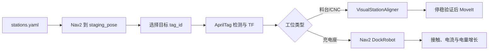

# 工位导航与 AprilTag 精对位

## 为什么分成两段

移动机械臂到工位不是一个控制器从头开到底，而是两个尺度不同的动作：

1. **Nav2 全局导航**读取静态地图、AMCL/里程计和 `stations.yaml` 的预停靠坐标，
   绕开障碍物到达工位附近。此阶段不依赖相机看见工位。
2. **局部视觉对位**选择该工位唯一的 AprilTag，依据相机观测闭环修正底盘，
   到达可重复的机械臂操作位；充电座使用 Nav2 Docking Server，料台和 CNC 使用
   物理订单执行器中的 `VisualStationAligner`。

全局坐标负责“到附近”，视觉负责“每次停在同一个相对位置”。机械臂抓取不应直接依赖
地图中零件的绝对坐标，而应使用工位/托盘坐标系和槽位偏移。



## 相机实际识别什么

相机识别的是黑白 **AprilTag 36h11** 纹理，不是物体颜色。每张纹理包含可纠错的唯一
数字 ID，检测节点结合相机内参和已知标签尺寸，输出标签相对相机的三维位置和方向。

| 工位 | Tag ID |
|---|---:|
| CNC 1 / 2 / 3 | 1 / 2 / 3 |
| 原料台 / 成品台 | 10 / 11 |
| 充电座 | 20 |

充电座绿色部分表示物理充电触点，不是视觉目标。模型已旋转，使绿色触点和 Tag 20
都朝向工厂内部及来车方向；Tag 位于短支架上，保证预停靠位相机能够稳定观测。

## 代码按数据流阅读

1. `factory_core/config/stations.yaml`：工位 ID、Tag ID、预停靠和物理参考坐标。
2. `factory_core/station_config.py`：把 YAML 校验成不可变的类型对象。
3. `factory_core/visual_station_alignment.py`：料台和 CNC 的局部视觉闭环。
4. `factory_core/dock_station.py`：独立 DockRobot 诊断入口。
5. `factory_perception/dock_pose_node.py`：过滤目标标签并发布位姿。
6. `factory_bringup/config/nav2_params.yaml`：Docking 插件参数。
7. `factory_core/twist_relay.py`：局部速度安全链。
8. `factory_core/physical_order_executor.py`：选择工位策略并等待底盘停稳。
9. `scripts/test_docking_truth.sh`：Gazebo 独立真值验收。

## 手工运行

持续启动完整物理栈：

```bash
ros2 launch factory_bringup physical_stack.launch.py use_navigation:=true
```

另一个终端可运行独立的 DockRobot 诊断；它不等同于订单中料台/CNC 的
`VisualStationAligner` 主路径：

```bash
source scripts/setup_ros_env.sh
ros2 run factory_core dock_station --ros-args -p station:=raw_bin
```

只验证自动化真值：

```bash
./scripts/test_docking_truth.sh
```

充电闭环单独验收：

```bash
./scripts/test_charging_truth.sh
```

该测试验证 Tag 20 导航和局部对位、Gazebo 黑盒真值、充电状态、正充电电流和电量增长。
正式 30-seed 批次中 `DockStation` 为 137/137，说明订单级对位叶节点均成功；这个
结果不是“最终位置误差小于某个数值”的统计，不能据此写 3 cm 精度。若要声明厘米级误差，
应另做每类工位的独立误差分布测试。所有正式数字以 `evaluation_results.md` 为准。

## Undock 与安全间距

订单主路径只有充电座调用 `UndockRobot`；成功表示机器人已退出接触并回到插件定义的
staging 区域。[Nav2 Docking Server 官方说明](https://docs.nav2.org/configuration/packages/configuring-docking-server.html)

料台和 CNC 使用里程计闭环直退到配置的安全间距，因为它们不是由 DockRobot 生命周期
进入的。三类工位策略为：

- 原料框/成品框：视觉对齐结束后里程计闭环退出；
- CNC：沿门框走廊直退；短时间返回同一机床时可跳过冗余全局规划；
- 充电座：`UndockRobot` 退出接触，必要时补足安全间距。

## WSL 仿真的特殊参数

WSL 软件渲染时，相机帧率可能低于模型配置值，因此检测等待上限按仿真最坏帧周期配置。
控制循环仍按时间戳判定新鲜度：旧帧不能累计稳定次数，超过允许年龄立即发布零速度，
超时则失败。等待上限只决定“最多等多久”，不授权用陈旧位姿继续运动。迁移环境后应重新
测量检测频率和延迟分布，再配置等待上限与新鲜度阈值。
