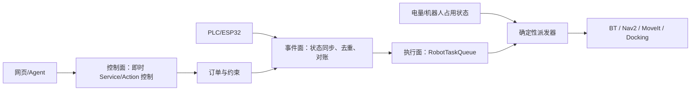

# 事件、控制面与机器人任务队列

## 为什么查询不能进入工作队列

系统同时存在三条不同通道，不能共用一个 FIFO：

1. **控制面**：状态查询、能力查询、暂停、取消、机床 HOLD/RESUME。查询应立即返回
   当前快照；控制命令应抢占普通派工检查，不能等待上下料结束才被读取。
2. **事件面**：PLC/ESP32 发布的机床状态变化。事件先按控制器会话和单调序号去重，
   再更新世界状态并生成需要机器人执行的任务。
3. **执行面**：导航、卸料、上料和回充等会长期占用机器人的任务。只有这类工作进入
   可持久化任务队列。



## 标识符职责

| 标识符 | 生命周期 | 用途 |
|---|---|---|
| `order_id` | 一次生产要求 | 统计数量、暂停/取消和用户查询 |
| `part_id` | 一个物料实体 | 保证零件只有一个位置和可追溯性 |
| `task_id` | 一次可恢复机器人任务 | 重试、依赖、检查点和执行反馈 |
| `event_id` | 一条机床控制器事件 | 防止网络重发生成重复任务 |
| `attempt` | 一次任务执行尝试 | 区分重试，不改变任务身份 |

事件 ID 由 `machine_id + controller_session + sequence` 组成。任务 ID 根据语义去重键
稳定生成，因此相同机床事件即使在重启后再次到达，也不会复制任务。

## 单夹爪机床服务流程

对于 `DONE` 且夹具内存在成品的机床：

1. 创建 `UNLOAD_FINISHED`；
2. 若仍有毛坯需求，创建依赖卸料成功的 `LOAD_RAW`；
3. 单夹爪必须先把成品送到成品框，再领取毛坯并返回机床；
4. `pick_part`、`place_part` 是执行器叶动作，不作为面向调度器的独立业务任务。

视觉只确认 PLC 状态与现场是否一致。不能先导航到机床，再由视觉临时猜测应该上料
还是卸料。若 `DONE` 与 `part_present=false`、或 `IDLE` 与 `part_present=true` 冲突，
任务不继续并报告状态不一致。

## 电量与安全检查点

任务执行过程中由当前任务负责到达安全检查点：放妥手持零件、退出 CNC 内部并停止
新的抓取。派发器只在安全任务边界选择下一项：

- 电量低于 25%：保留所有排队任务，不预订新任务，先回充；
- 充电期间：机床事件仍可入队；
- 电量达到 80%：按优先级和依赖关系恢复派发；
- `UNLOAD_FINISHED` 优先于 `LOAD_RAW`，因为卸料能释放被占用机床。

## 故障与改派边界

- 故障发生在 `LOAD_RAW` 尚未预订时：调度直接跳过该机；
- 故障发生在待办已生成但机器人尚未执行时：取消原待办，释放同一个原料 ID，后续健康
  机床的 `IDLE` 事件生成新的稳定任务 ID；
- 故障发生在夹具已经锁定工件后：不得自动 RESET 或伪造卸料成功，该子任务进入人工介入；
- 同批次其他健康机床仍可继续卸料，订单最终返回部分完成数和独立错误码。

## 当前代码映射

- `task_models.py`：任务、事件、状态、优先级和稳定任务 ID；
- `task_queue.py`：入队去重、依赖检查、预订、重试和序列化；
- `state_reconciler.py`：把权威机床状态转换成卸料/上料任务；
- `task_dispatcher.py`：在任务边界应用电量与机器人占用策略；
- `task_queue_store.py`：原子保存和恢复队列；
- `machine_event_adapter.py`：把周期性 `MachineState` 快照压缩为有序语义事件；
- `machine_task_runtime_store.py`：把事件游标和任务队列作为同一个版本化记录原子保存；
- `machine_task_queue_node.py`：订阅三台机床状态并提供类型化队列查询 Service；
- `robot_task_request.py`：把领域任务映射为类型化物理请求；原料的 `slot_id=1` 仅表示
  整个料框选择区域，不携带工件实体身份；
- `ReconcileRobotTask.srv`：在现场核对后受约束地重试、确认完成或取消失败任务；
- `RobotTaskState.msg`：同时公开最终状态、最后物理阶段和人工对账审计备注；
- `ExecuteRobotTask.action`：只承载一项 `LOAD_RAW` 或 `UNLOAD_FINISHED`，不暴露速度
  和关节控制；
- `manipulation_config.py`：固定设施/成品槽几何、原料框选择区域、工位角色和请求校验；
- `manipulate_part_server.py`：MoveIt、双指接触/关节证据和支撑接触的分阶段 Action 执行器；
- `factory_task_bt/behavior_trees`：运行时唯一的整单、装料与卸料顺序；
- `factory_task_bt_executor`：接收整单和单任务 Action，持有机器人互斥锁并 tick 行为树；
- `physical_step_action.cpp`：异步调用原子 Action，halt 时取消当前物理动作；
- `physical_order_executor.py`：只适配 Docking、MoveIt Action、PLC 和库存 Service；
- `PartTransfer.srv`：物理抓取/放置成功后的原料与成品库存确认；
- `test_task_queue.py`：事件去重、恢复零件、依赖、电量门控和持久化场景。

队列和状态协调核心仍是无 ROS 依赖的领域层；ROS 适配节点现已把
`/machine_x/state` 正式接到 `state_reconciler`。节点只对
`state + part_present + part_id` 的业务变化生成事件，门开关和周期性重复快照不会
重复入队；独立的存在传感器允许未知零件 ID 的启动恢复。事件会话、
单机序号和队列作为一个 JSON 记录一起恢复。`GetRobotTaskQueue.srv` 可立即查询待办、
执行中和终态数量，而查询本身不会进入执行队列。

该节点默认仍是**只观察模式**。显式设置
`enable_task_queue_runtime:=true task_queue_dispatch_enabled:=true` 后，Worker 才会按
优先级逐项调用 `/factory/execute_robot_task`。C++ `factory_task_bt_executor` 同时服务整单
`ExecuteOrder` 和单任务 Action，并用同一互斥占用位保证任意时刻只有一个目标进入物理
会话；并发目标会被明确拒绝，而不是同时控制 Nav2、Docking、MoveIt、夹爪和 PLC。

任务先原子保存为 `RESERVED`，在发送 Action 之前再原子保存为 `RUNNING`，结果返回后
保存终态。这个保守边界保证 `RESERVED` 一定尚未发送，可以在重启时安全回到
`PENDING`；只要任务已进入可能发送的阶段，重启就会把 `RUNNING` 转为 `FAILED` 并要求
人工核对机器人、工件、库存和 PLC，不会盲目重放可能执行了一半的动作。每条 Action
反馈还会把 `last_phase/last_feedback` 原子写入同一个队列文件，帮助判断中断发生在
导航、抓取、PLC 提交还是放置阶段，但该信息不能代替现场传感器核对。

物理 Action 返回不可重试失败时，Worker 同样进入 fail-stop：当前任务保存为 `FAILED`，
后续待办保持 `PENDING`，查询接口明确返回“等待人工对账”。在确认夹爪是否持件、零件
实际位置、库存和 PLC 寄存器之前，系统不会自行执行下一项任务。

人工核对完成后使用类型化服务选择唯一一种结果：

```bash
ros2 service call \
  /factory/reconcile_robot_task \
  factory_interfaces/srv/ReconcileRobotTask \
  "{task_id: TASK_ID, resolution: 0, physical_state_verified: true,
    operator_note: 'robot empty and part remains in source slot'}"
```

- `resolution=0/RETRY`：现场确认动作没有生效，原任务回到 `PENDING`；
- `resolution=1/MARK_SUCCEEDED`：现场和 PLC 已反映任务完成，依赖任务才可解锁；
- `resolution=2/CANCEL`：工件已隔离，不再执行该任务；
- `physical_state_verified=false` 或空备注一律拒绝；
- 仍有其它 `FAILED` 任务时，解决一项也不会解除全局停止派发。

对账决议和备注单独保存为 `reconciliation_note`，后续成功或失败结果不会覆盖审计记录。

2026-07-30 的三机床 Gazebo 正式验收中，PLC 事件动态形成六项任务，实际顺序为
装1→装2→卸1→卸2→装3→卸3：加工完成的卸料会按优先级插到待装料任务之前，插队后
原任务仍可恢复执行。最终 6/6 成功，原料/成品库存为 3/3，三台 CNC 均为 IDLE，证明
该队列并非固定播放一段预录流程。

## 成品框感知与确定性放置边界

成品框空槽判断属于执行前的状态解析，不是另一套运动控制器：


- 检测器发布每个教导槽位，而不只发布“看见的空位”；
- 视野外/无深度为 `unknown`，较近结构或工件前景为 `occupied`，执行器对两者都
  fail closed；
- 放置时先尝试任务预留槽，再按配置顺序寻找其它稳定空槽；
- 槽位 4 提供冗余，避免一个固定支架遮住槽位 3 后整单无处放置；
- LLM、Agent 和感知节点都不能把位姿或关节指令注入 MoveIt。

“原料选件”与“成品选槽”是两种不同问题：原料检测输出匿名目标集合，成品检测输出已
教导放置位的 `empty/occupied/unknown`。原料不按槽位编号挑选；成品仍需选择一个经多帧
确认可见且为空的安全放置槽。批量成功率只能来自整单固定种子验收。

Worker 的派发心跳使用单调墙钟，避免节点在 Gazebo `/clock` 从系统时间跳回零时永久
卡住；物理执行器还会等待 docking lifecycle 进入 `ACTIVE`。料框采用“Nav2 预停靠位
→ AprilTag 视觉修正 → 测距直退”，CNC 由 Nav2 保证横向和朝向、AprilTag 只闭合机械臂
最敏感的前后距离，避免差速底盘为几厘米横向误差反复三点侧移。充电座才使用完整
DockRobot/UndockRobot。运行中断后不根据 `raw_part_N` 猜测业务身份；已进入可能产生
物理效果的任务进入 fail-stop，必须用夹爪、机床寄存器、库存和成品框占用证据人工对账，
不能盲目重放一半的抓放动作。
